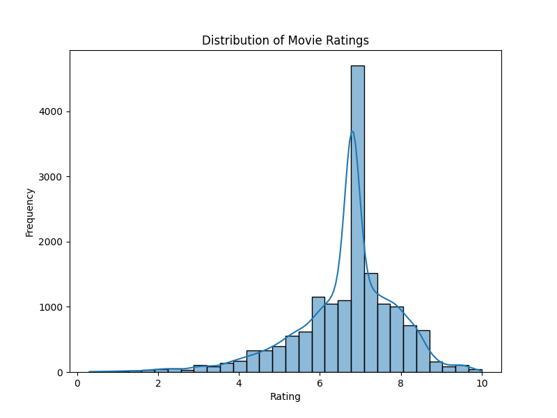

# Analysis of Movies Dataset with Metacritic Ratings (1910–2024)

Prepared by Arda Batın Tank

## Table of Contents

- [1. Brief Description of the Dataset and Summary of Its Attributes](#1-brief-description-of-the-dataset-and-summary-of-its-attributes)
  - [Dataset Overview](#dataset-overview)
  - [Key Attributes](#key-attributes)
- [2. Initial Plan for Data Exploration](#2-initial-plan-for-data-exploration)
- [3. Actions Taken for Data Cleaning and Feature Engineering](#3-actions-taken-for-data-cleaning-and-feature-engineering)
  - [Data Cleaning](#data-cleaning)
  - [Feature Engineering](#feature-engineering)
- [4. Key Findings and Insights](#4-key-findings-and-insights)
  - [Descriptive Statistics](#descriptive-statistics)
  - [Distribution Analysis](#distribution-analysis)
  - [Correlation Analysis](#correlation-analysis)
  - [Feature Importance](#feature-importance)
- [5. Formulating Hypotheses](#5-formulating-hypotheses)
  - [Hypothesis 1](#hypothesis-1)
  - [Hypothesis 2](#hypothesis-2)
  - [Hypothesis 3](#hypothesis-3)
- [6. Conducting a Formal Significance Test for Hypothesis 1](#6-conducting-a-formal-significance-test-for-hypothesis-1)
  - [Hypothesis Details](#hypothesis-details)
  - [Test Execution](#test-execution)
  - [Conclusion](#conclusion)
- [7. Suggestions for Next Steps in Analyzing This Data](#7-suggestions-for-next-steps-in-analyzing-this-data)
- [8. Summary of Data Quality and Request for Additional Data](#8-summary-of-data-quality-and-request-for-additional-data)
  - [Data Quality Assessment](#data-quality-assessment)
  - [Request for Additional Data](#request-for-additional-data)
- [Conclusion](#conclusion)
- [Related Python Code](#related-python-code)

## 1. Brief Description of the Dataset and Summary of Its Attributes

### Dataset Overview

The dataset encompasses detailed information on over **16,000 movies** released between **1910 and 2024**, along with their corresponding **Metacritic ratings**. It serves as a rich resource for analyzing trends in cinema over more than a century.

### Key Attributes

- **Title**: Name of the movie.
- **Release Date**: Official release date.
- **Description**: Brief synopsis or critical overview.
- **Rating**: Average Metacritic score (on a scale of 1 to 10).
- **No of Persons Voted**: Number of individuals who rated the movie on Metacritic.
- **Directed by**: Director(s) of the movie.
- **Written by**: Screenwriter(s) responsible for the script.
- **Duration**: Runtime of the movie in minutes.
- **Genres**: Genre(s) the movie falls under (e.g., Drama, Comedy, Action).

## 2. Initial Plan for Data Exploration

- **Data Import and Structure Analysis**:
  - Load the dataset and examine its structure, dimensions, and data types.
- **Descriptive Statistics**:
  - Compute summary statistics for numerical variables (`Rating`, `No of Persons Voted`, `Duration`).
- **Missing Values Identification**:
  - Detect and quantify missing values in each attribute.
- **Data Type Verification**:
  - Ensure all attributes have appropriate data types (e.g., dates, numeric values).
- **Distribution Analysis**:
  - Analyze the distribution of Metacritic ratings.
  - Examine the frequency and distribution of genres over time.
  - Explore the distribution of movie durations.
- **Correlation Analysis**:
  - Assess relationships between variables (e.g., `Rating` vs. `Duration`).
- **Director and Writer Impact**:
  - Analyze the influence of directors and writers on movie ratings.

## 3. Actions Taken for Data Cleaning and Feature Engineering

### Data Cleaning

- **Handling Missing Values**:
  - Filled missing values in `Rating`, `No of Persons Voted`, and `Duration` with median values.
  - Filled missing values in `Genres`, `Directed by`, and `Written by` with 'Unknown'.
- **Correcting Data Types**:
  - Converted `Release Date` to datetime format and extracted `Release Year`.
  - Ensured `No of Persons Voted` and `Duration` are numeric.
- **Converting Duration**:
  - Transformed `Duration` from formats like '9 h 32 m' to total minutes.

### Feature Engineering

- **Simplifying Genres**:
  - Extracted the first genre listed for movies with multiple genres.
- **Encoding Categorical Variables**:
  - Applied label encoding to `Genres`, `Directed by`, and `Written by`.

## 4. Key Findings and Insights

### Descriptive Statistics

| **Statistic**      | **Rating** | **No of Persons Voted** | **Duration (min)** |
|--------------------|------------|-------------------------|--------------------|
| Count              | 1,629      | 1,629                   | 1,629              |
| Mean               | 6.656      | 80.679                  | 102.739            |
| Standard Deviation | 1.259      | 138.289                 | 24.353             |
| Minimum            | 0.3        | 4                       | 0                  |
| Maximum            | 10         | 996                     | 808                |

*Table 1: Summary Statistics for Key Numerical Variables*

### Distribution Analysis

*Figure 1: Distribution of Movie Ratings*

*Figure 2: Top 10 Most Common Genres*

Numbers in Figure 2 represent genres:

1. Adventure
2. Animation
3. Biography
4. Comedy
5. Crime
6. Documentary
7. Drama
8. Family
9. Fantasy
10. History
11. Horror
12. Music
13. Musical
14. Mystery
15. Romance
16. Sci-Fi
17. Thriller
18. Unknown
19. War
20. Western

### Correlation Analysis

*Figure 3: Correlation Matrix of Features and Target Variable*

**Key Observations**:

- There is a moderate positive correlation between **"No of Persons Voted"** and **"Rating"**, suggesting that movies with more votes tend to have higher ratings.
- A moderate positive correlation exists between **"Directed by"** and **"Written by"**, indicating that directors and writers often collaborate or are the same person.
- The **"Genres"** feature shows a weak positive correlation with **"No of Persons Voted"**.

### Feature Importance

*Figure 4: Feature Importance Derived from Random Forest Model*

**Key Observations**:

- The **"No of Persons Voted"** feature has the highest importance, indicating that the number of votes significantly influences the movie's rating.
- **"Duration"** and **"Genres"** also contribute to predicting movie ratings.
- Encoded features for **"Directed by"** and **"Written by"** have lower importance, suggesting individual directors or writers have less impact compared to other factors.

## 5. Formulating Hypotheses

### Hypothesis 1

**Statement**: Movies directed by prolific directors (those with more than five films in the dataset) have higher average Metacritic ratings than those directed by less prolific directors.

### Hypothesis 2

**Statement**: Drama movies have higher average Metacritic ratings compared to other genres.

### Hypothesis 3

**Statement**: Movies released after the year 2000 have higher average Metacritic ratings than movies released before 2000.

## 6. Conducting a Formal Significance Test for Hypothesis 1

### Hypothesis Details

- **Null Hypothesis (H₀)**: There is no difference in the average ratings between movies directed by prolific directors and those directed by less prolific directors.
- **Alternative Hypothesis (H₁)**: Movies directed by prolific directors have higher average ratings.

### Test Execution

- Segmented directors into two groups based on the number of movies they have directed.
- Calculated the average ratings for both groups.
- Performed an independent samples t-test.
  - **Test Statistic (t)**: **11.89**
  - **p-value**: **0.0000**

### Conclusion

- **Decision**: Reject the null hypothesis at the 0.05 significance level.
- **Interpretation**: There is significant evidence to suggest that movies directed by prolific directors have higher average ratings.

## 7. Suggestions for Next Steps in Analyzing This Data

1. **Integrate Additional Data Sources**:
   - Include box office revenue, awards, and nominations to enhance analysis.
2. **Advanced Modeling Techniques**:
   - Utilize machine learning models like Gradient Boosting or Neural Networks for better predictions.
3. **Sentiment Analysis**:
   - Analyze movie descriptions using NLP techniques to extract sentiment scores.

## 8. Summary of Data Quality and Request for Additional Data

### Data Quality Assessment

**Strengths**:

- Comprehensive dataset covering over a century of cinema.
- Rich in critical attributes necessary for in-depth analysis.

**Limitations**:

- Presence of missing values in key fields such as `Duration` and `Rating`.
- Lack of financial data like budget and box office revenue.
- Absence of audience ratings from platforms other than Metacritic.

### Request for Additional Data

To enhance the depth and accuracy of the analysis, the following additional data is requested:

- **Box Office Revenue and Budget Information**:
  - To analyze the relationship between financial success and critical acclaim.
- **Audience Ratings from Other Platforms**:
  - To compare and contrast critical and audience perceptions.
- **Awards and Nominations Details**:
  - To assess the impact of industry recognition on movie ratings.

## Conclusion

This analysis provides valuable insights into the factors influencing movie ratings over the past century. By addressing data quality issues and incorporating additional data, future analyses can yield even more comprehensive and actionable findings. The significance test conducted supports the hypothesis that prolific directors tend to produce higher-rated movies, offering a strategic consideration for future movie production and acquisition decisions.

---

## Related Python Code

To see the related Python code, please [click here](https://github.com/ardabtank/movies_analysis/blob/main/modelling_code.py).

